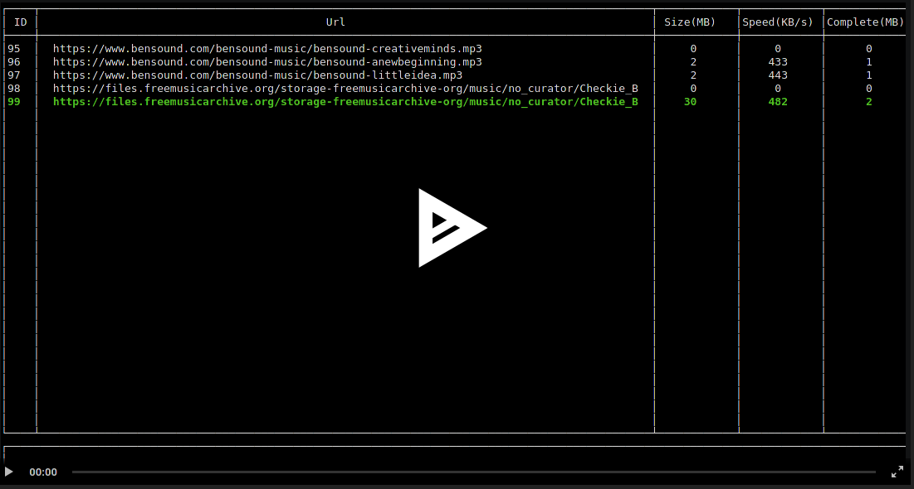

<h4 align="center">
      
</h4>

[](https://asciinema.org/a/dK2lxcmSdjhrX0hpb7btywJxu)

## Installation

### Install it from source
You can install neodm by compiling from source, here's the list of dependencies required:

#### hostmake dependencies:
 - `pkg-config`
 - `cmake`
 - `gcc` or `clang`

#### buildtime dependencies:
 - `ncurses-devel`
 - `sqlite-devel`
 - `cdk`
 - `libaria2-devel`

#### Building
```
git clone https://github.com/LinArcX/neodm
mkdir build; mkdir release; cd build
cmake -DCMAKE_BUILD_TYPE=RELEASE ../;
make
```
And finally, run it:

`./release/neodm`

## Who's Neo?
<h1 align="center">
    
</h1>

## Donate
- Bitcoin: `13T28Yd37qPtuxwTFPXeG9dWPahwDzWHjy`


- Monero: `48VdRG9BNePEcrUr6Vx6sJeVz6EefGq5e2F5S9YV2eJtd5uAwjJ7Afn6YeVTWsw6XGS6mXueLywEea3fBPztUbre2Lhia7e`


## License

